
<h1 align="center">学术团队管理系统+jsp</h1>

## 简介
学术团队管理系统：支持个人中心、会议通知、学术成果、签到签退、周报管理等功能，适用于学术团队的信息化管理与高效协作。    --计算机毕业设计源码；毕设源码；java毕业设计源码

## 联系方式

<h3 align="center">获取完整代码与数据库文件 + 微信：deepguan QQ: 86050149 QQ群: 783742310</h3>

<h3 align="center">可帮忙远程部署 包运行成功！提供远程部署、修改代码、设计文档指导、代码讲解等服务！</h3>

## 功能介绍（完整见运行截图）
管理员： 管理员拥有对整个学术团队管理系统的全面控制，能够进行用户注册、登录管理，并维护系统的各个功能模块。负责管理人员信息，包括教师和学生数据的录入、编辑、查看和删除。能够发布和管理会议通知及学术周报，设定会议类型，添加参会人员信息，同时查看和管理学术成果报告。管理员还具备调整系统设置和查看系统信息的权限，以确保平台的日常运行和政策更新。

导师： 导师主要负责管理学生信息，通过个人中心功能查看和修改个人资料，管理所负责学生的签到和签退信息。导师能够接收和查看会议通知，对学术周报及会议成果进行评估，并与学生进行学术上的交流和互动。导师可以发布和管理会议类型，负责上传相关会议资料及设定参会人员名单，确保学术会议的顺利进行。

学生： 学生在系统中进行学号、姓名、联系方式及专业信息的注册和登录，以便访问个人中心，修改和查看个人信息。学生签到管理功能允许学生查看和提交签到信息，包含签到时间和相关备注。学生还可以查看接收到的会议通知、参加学术会议，并与导师和同学保持学术互动，查看和提交学术周报内容。

访客： 访客可浏览公共的学术团队管理系统页面，获取有关科研工作、学术会议的最新动态及学术成果展示信息。访客可以使用搜索功能筛选感兴趣的会议或周报内容，也可以通过页面上的导航菜单与系统进行有限度的交互，例如查看周报展示区及相应图片。访客无法进行多余的系统操作，如信息输入和数据提交，保证系统安全和用户隐私。

## 运行截图
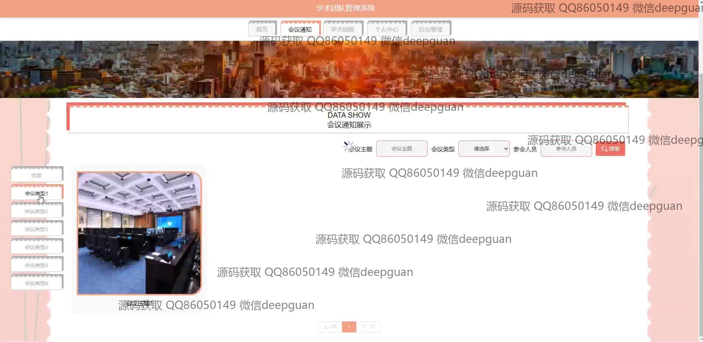
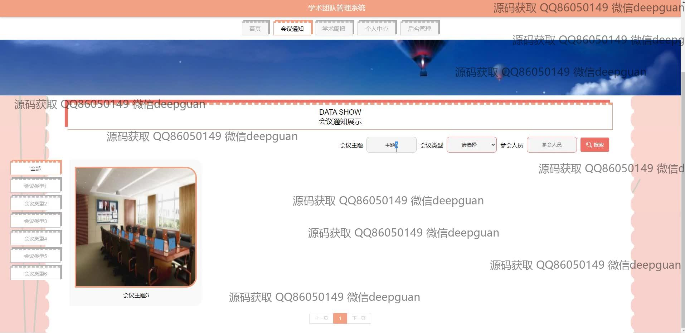
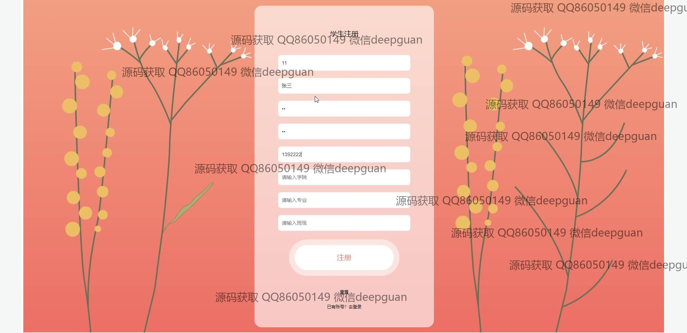
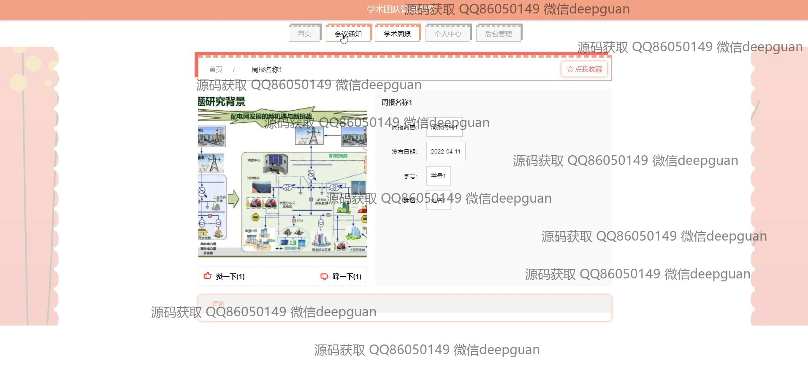
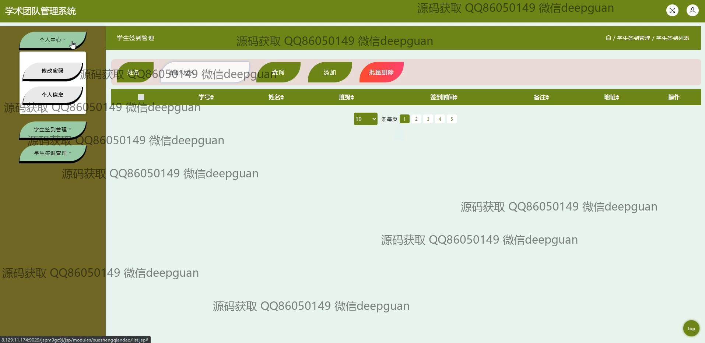

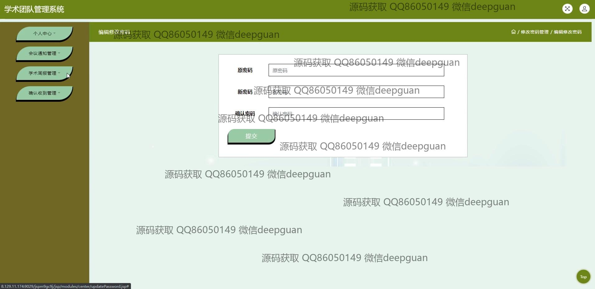
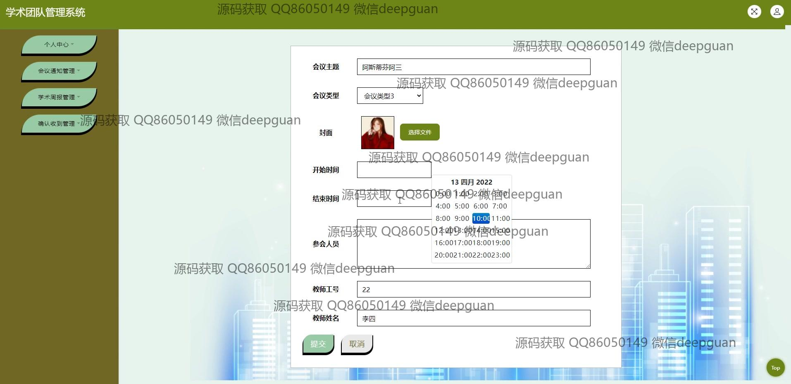
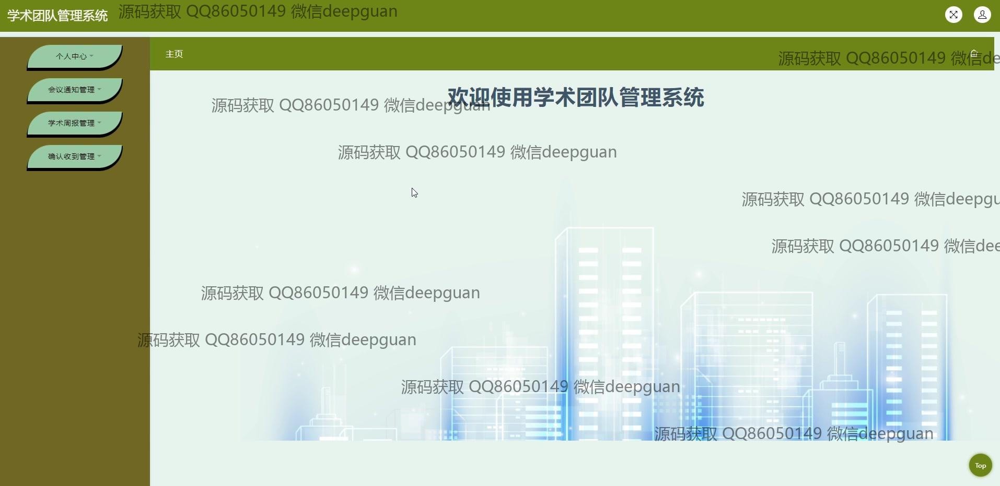

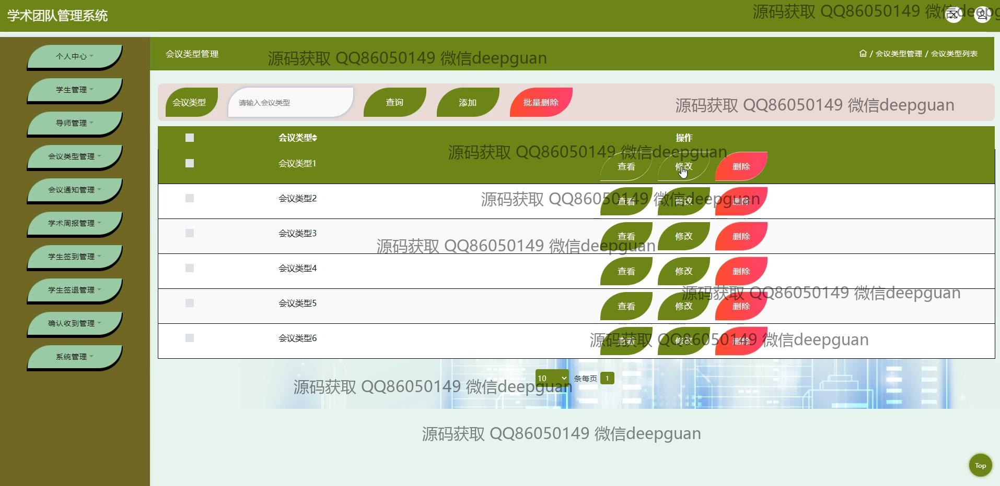
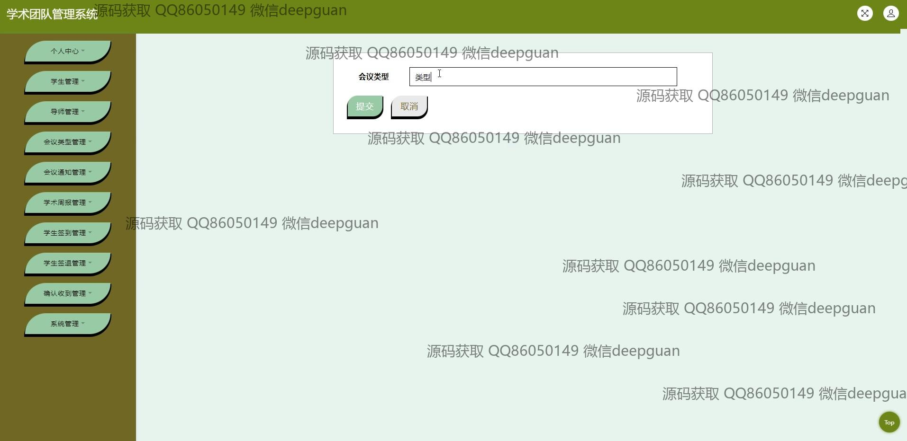
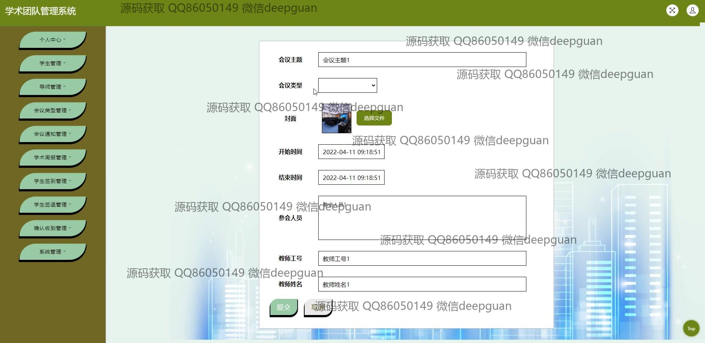
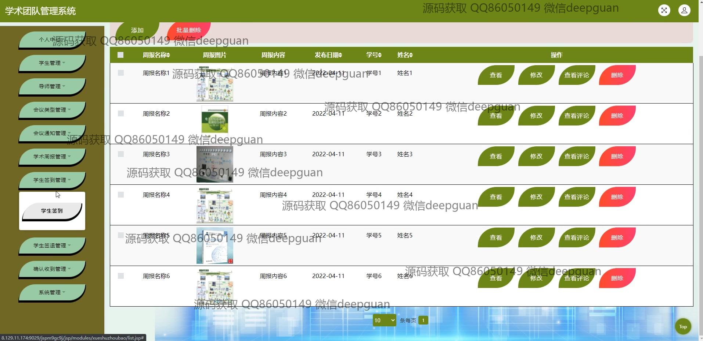
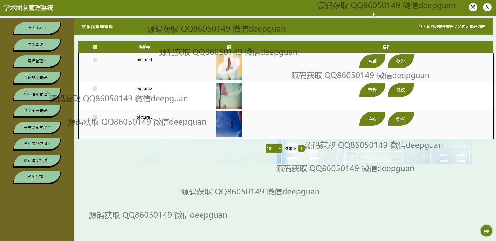
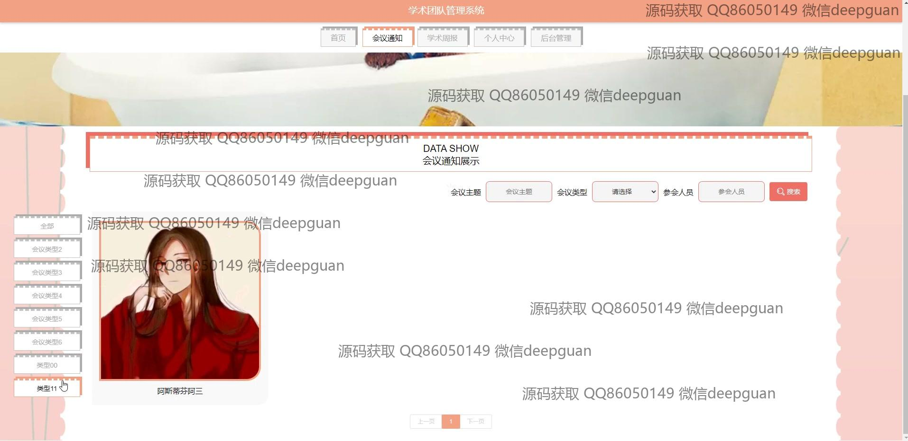
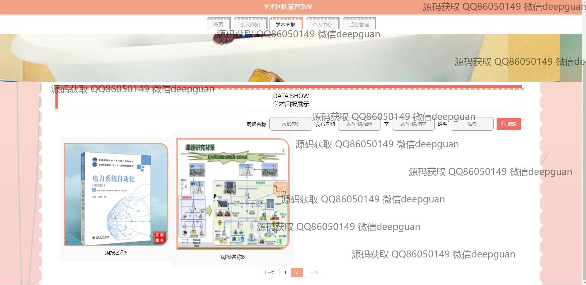
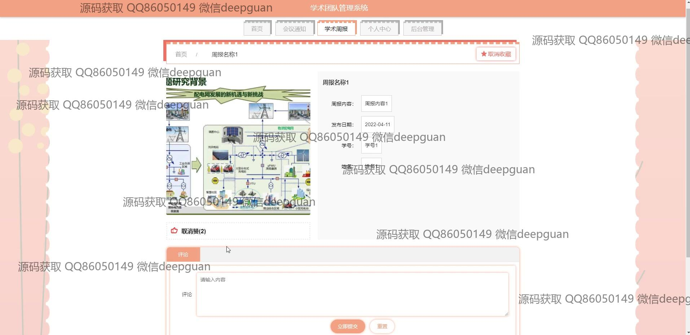
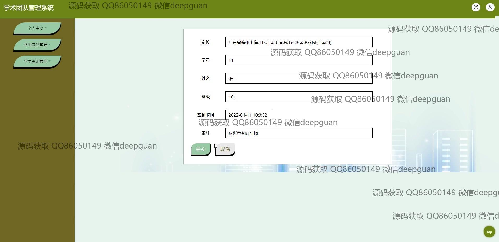
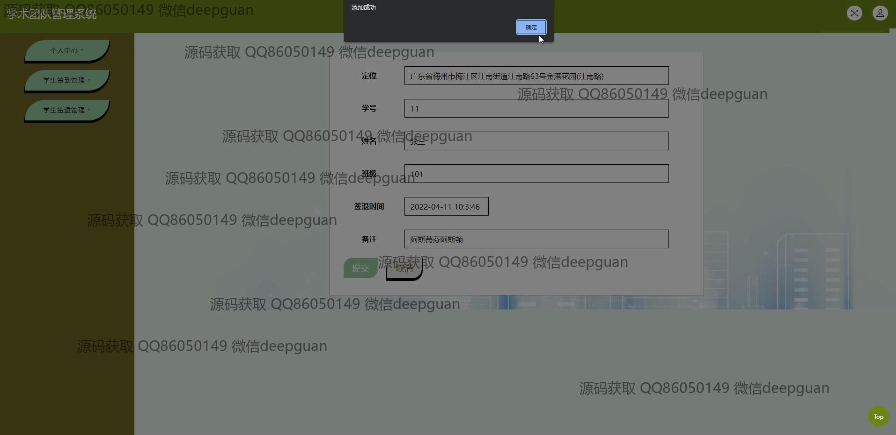
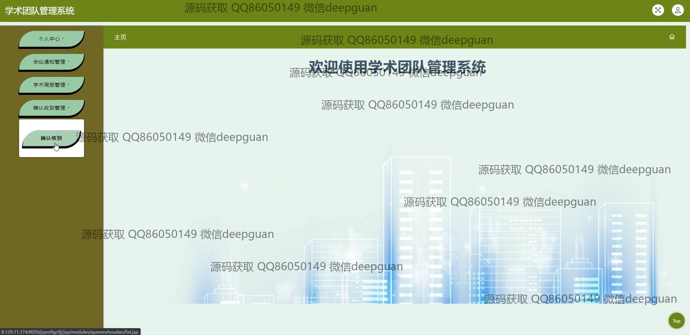

本代码来源于网络,仅供学习参考使用!

